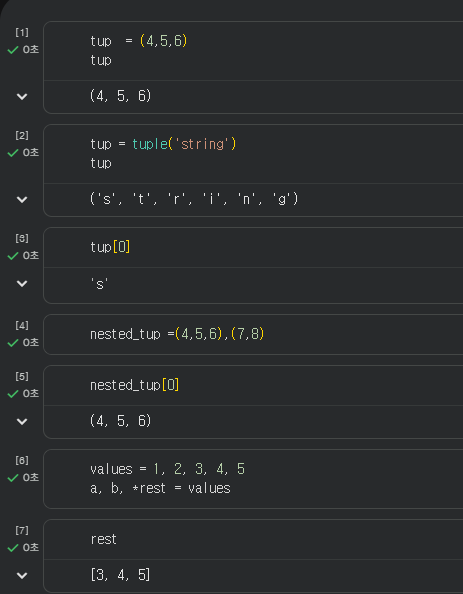
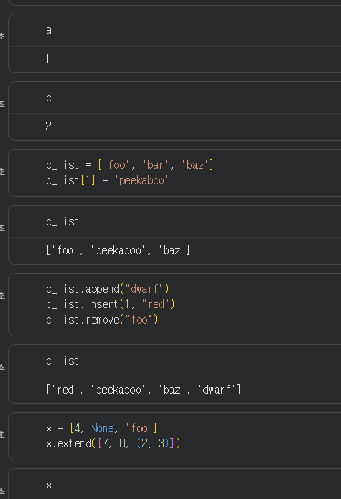
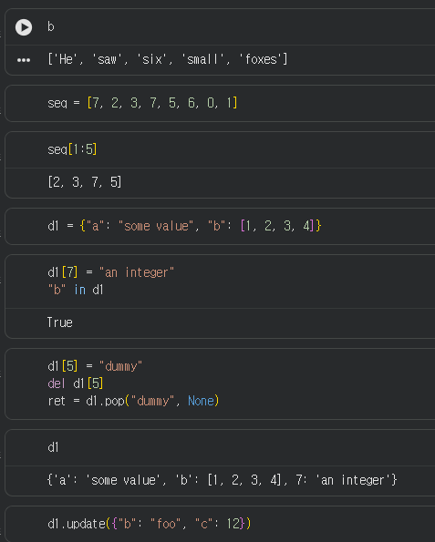
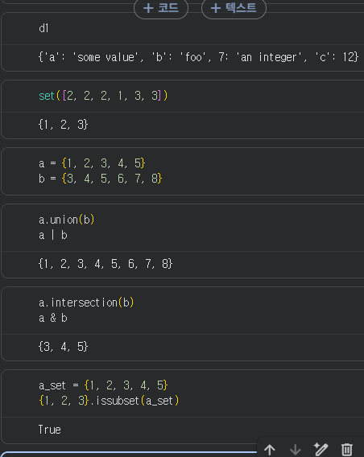
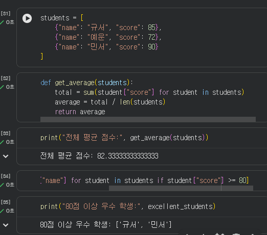

# Python 2주차 정규 과제 

📌Python 정규과제는 매주 정해진 분량의 『*파이썬 라이브러리를 활용한 데이터 분석*』 을 읽고 학습하는 것입니다. 이번주는 아래의 **Python_2nd_TIL**에 나열된 분량을 읽고 공부하시면 됩니다.

아래의 문제를 풀어보며 학습 내용을 점검하세요. 문제를 해결하는 과정에서 개념을 스스로 정리하고, 필요한 경우 참고 자료를 통해 보완하는 것이 좋습니다.

**교재 실습 예제 파일은 07_Python_Template 레포지토리의 notebooks 폴더에 업로드되어 있습니다.**

**👀(수행 인증샷은 필수입니다.)** 

## Python_2nd_TIL

### 3장 내장 자료구조, 함수, 파일
#### 1. 자료구조와 순차 자료형
#### 2. 함수
#### 3. 파일과 운영체제
#### 4. 마치며


## Study Schedule

| 주차  | 공부 범위     | 완료 여부 |
| ----- | ------------- | --------- |
| 1주차 | p.25~82    | ✅         |
| 2주차 | p.83~129   | ✅         |
| 3주차 | p.131~179  | 🍽️         |
| 4주차 | p.181~246 | 🍽️         |
| 5주차 | p.247~309 | 🍽️         |
| 6주차 | p.310~379 | 🍽️         |
| 7주차 | p.381~465 | 🍽️         |


<br>

<!-- 여기까진 그대로 둬 주세요-->

---

# 1️⃣ 학습 내용 정리

## 1. 자료구조와 순차 자료형


1. 튜플
- 한 번 할당 되면 변경 x
- 고정 길이
```
In: tup  = (4,5,6)
In: tup
Out: (4,5,6)
```

- 텍스트 튜플화 가능
- 인덱스 적용 가능
```
In: tup = tuple('string')
In: tup
Out: ('s','t','r','i','n','g')

In: tup[0]
Out: 's'
```

- 튜플의 튜플화
```
In : nested_tup =(4,5,6),(7,8)
In: nested_tup[0]
Out: (4,5,6)
```
- 저장된 객체 변경 가능
- BUT


### 1-1. 튜플 (Tuple)

- 한 번 할당되면 **절대 값을 바꿀 수 없는(불변, immutable)** 고정 길이를 갖는 자료형
- 주로 쉼표(`,`)나 괄호 `()`를 써서 생성

* **특징**: 튜플에 저장된 객체 자체는 변경이 가능, BUT 한 번 생성되면 각 슬롯에 저장된 객체를 변경하는 것은 불가능
* **언패킹(Unpacking)**: 변수 여러 개에 튜플 값을 한 번에 쪼개서 넣을 때 편리

#### 활용

**1. 튜플 생성하기**
중첩된 튜플도 생성이 가능하다.
```python
tup = (4, 5, 6)
nested_tup = ((4, 5, 6), (7, 8))
```

**2. 튜플 언패킹 활용**
이 기능을 활용하면 두 변수의 값을 아주 쉽게 바꿀 수 있다.
```python
a, b = 1, 2
b, a = a, b
```

**3. `*rest` 활용하기**
원하는 부분만 변수에 담고, 길이를 알 수 없는 긴 인수를 담기 위한 방법으로 나머지 요소들은 리스트로 묶어서 반환한다. `rest`라는 이름 자체에는 특별한 의미가 없다.
```python
values = 1, 2, 3, 4, 5
a, b, *rest = values
```

---

### 1-2. 리스트 (List)

- 튜플과 대조적으로 크기나 내용을 **내 마음대로 자유롭게 바꿀 수 있는(가변, mutable)** 자료형
- 대괄호 `[]`를 사용

* **추가/삭제**: `append`(끝에 추가), `insert`(원하는 위치에 추가), `pop`(빼내기), `remove`(삭제)를 지원
* **병합**: `+`로 합칠 수도 있지만, 데이터가 많을 땐 `extend()`를 쓰는 게 연산 비용 면에서 훨씬 좋음

#### 활용

**1. 리스트 생성 및 변경**
```python
b_list = ['foo', 'bar', 'baz']
b_list[1] = 'peekaboo' 
```

**2. 원소 추가와 삭제**
`insert`로 특정 위치에 넣고, `remove`로 제일 앞에 위치한 동일한 값을 찾아서 지울 수 있다.
```python
b_list.append("dwarf")
b_list.insert(1, "red")
b_list.remove("foo")
```

**3. 리스트 합치기**
큰 리스트일수록 `extend` 메서드를 사용하는 것이 일반적이다.
```python
x = [4, None, 'foo']
x.extend([7, 8, (2, 3)])
```

**4. 정렬 (sort)**
`key` 옵션을 주면 문자열 길이 등 원하는 기준으로 새로운 리스트를 생성하지 않고 있는 그대로 정렬할 수 있다.
```python
b = ["saw", "small", "He", "foxes", "six"]
b.sort(key=len)
```

---

### 1-3. 슬라이싱 (Slicing)

- 리스트나 튜플처럼 순서가 있는 자료형을 내가 원하는 만큼 싹둑 잘라내는 기능
- `[start:stop]` 형태

#### 활용

기본으로 사용할 리스트:
```python
seq = [7, 2, 3, 7, 5, 6, 0, 1]
```

**1. 인덱스 1부터 4까지 자르기**
```python
seq[1:5]
```

**2. 슬라이싱에 값 대입하기**
슬라이싱에 다른 순차 자료형을 대입하여 요소의 값을 변경할 수도 있다.
```python
seq[3:5] = [6, 3]
```

---

### 1-4. 딕셔너리 (Dictionary)

- 파이썬에서 제일 중요한 자료구조!
- 다른 언어의 해시 맵(Hash Map)과 비슷하며 **키(Key)와 값(Value)**이 쌍으로 묶여있음
- 중괄호 `{}`를 씀

* **접근**: 리스트처럼 인덱스 숫자가 아니라 `키(Key)` 이름으로 값을 부르고 넣는다.

#### 활용

**1. 딕셔너리 생성**
```python
d1 = {"a": "some value", "b": [1, 2, 3, 4]}
```

**2. 값 추가 및 확인**
`in` 예약어로 키가 존재하는지 검사할 수 있다.
```python
d1[7] = "an integer"
"b" in d1
```

**3. 값 삭제하기**
`del`을 쓰거나 `pop`을 이용해 반환과 동시에 삭제할 수 있다.
```python
d1[5] = "dummy"
del d1[5]
ret = d1.pop("dummy", None)
```

**4. 두 딕셔너리 합치기**
기존에 존재하는 키가 겹칠 경우 새로운 값으로 덮어씌워진다.
```python
d1.update({"b": "foo", "c": 12})
```

---

### 1-5. 집합 (Set)

- **고유한 원소만 담기 때문에 중복을 알아서 제거**
-  순서라는 개념이 없움

* `set()` 함수를 쓰거나 중괄호 `{}` 안에 값만 넣어서 만듦

#### 활용

**1. 집합 만들기**
리스트를 넣으면 자동으로 중복이 제거된다.
```python
set([2, 2, 2, 1, 3, 3])
```

기본 연산을 위한 집합 2개:
```python
a = {1, 2, 3, 4, 5}
b = {3, 4, 5, 6, 7, 8}
```

**2. 합집합**
`union` 메서드나 `|` 기호를 사용한다.
```python
a.union(b)
a | b
```

**3. 교집합**
`intersection` 메서드나 `&` 기호를 사용한다.
```python
a.intersection(b)
a & b
```

**4. 부분집합 검사**
`issubset`을 사용하여 포함 여부를 확인한다.
```python
a_set = {1, 2, 3, 4, 5}
{1, 2, 3}.issubset(a_set)
```

### 1-6. 내장 순차 자료형 함수
순차 자료형과 함께 자주 쓰는 기본 함수들이다.

#### `enumerate()`
- 인덱스와 값을 함께 반복할 수 있게 해준다.

#### `zip()`
- 여러 순차 자료형의 같은 위치 원소끼리 묶어준다.

#### `sorted()`
- 정렬된 새 리스트를 반환한다.

#### `reversed()`
- 역순으로 순회할 수 있게 해준다.

#### 의미
- 반복문을 더 짧고 명확하게 작성할 수 있다.
- 데이터 전처리 과정에서 자주 사용된다.

---

### 1-7. 리스트, 집합, 딕셔너리 컴프리헨션
- 컴프리헨션은 **반복 + 조건 + 생성**을 한 줄에 표현하는 문법이다.
- 파이썬의 간결함을 잘 보여주는 기능이다.

#### 리스트 컴프리헨션
- 조건에 맞는 값을 뽑아 새 리스트를 만든다.

#### 집합 컴프리헨션
- 중복 없는 결과를 만든다.

#### 딕셔너리 컴프리헨션
- 키-값 구조를 한 번에 생성한다.

#### 핵심 포인트
- 코드가 짧고 직관적이다.
- 다만 너무 중첩되면 가독성이 떨어질 수 있다.


### 실습 인증


## 실습 인증







## 2. 함수

### 개념정리

### 2-1. 함수의 기본 개념
- 함수는 **반복되는 로직을 묶어 재사용하기 위한 도구**다.
- 입력을 받아 처리한 뒤 결과를 반환한다.

#### 핵심 포인트
- 반환문이 없으면 기본적으로 `None`을 반환한다.
- 함수는 코드의 재사용성과 가독성을 높여준다.

---

### 2-2. 네임스페이스와 스코프
- 변수는 정의된 위치에 따라 접근 가능한 범위가 달라진다.
- 이를 **스코프(scope)** 라고 한다.

#### 구분
- 전역 변수: 함수 밖에서 정의
- 지역 변수: 함수 안에서 정의

#### 관련 키워드
- `global`: 함수 안에서 전역 변수 수정
- `nonlocal`: 중첩 함수에서 바깥 함수의 지역 변수 수정

#### 의미
- 스코프를 이해해야 변수 충돌을 막고 함수 동작을 정확히 이해할 수 있다.

---

### 2-3. 여러 값 반환하기
- 파이썬 함수는 여러 값을 한 번에 반환할 수 있다.
- 실제로는 이 값들이 **튜플 형태로 묶여 반환**된다.

#### 의미
- 여러 결과를 동시에 넘겨줄 수 있어 유연하다.
- 반환 후 언패킹해서 바로 각 변수에 저장할 수 있다.

---

### 2-4. 함수도 객체다
- 파이썬에서는 함수도 하나의 객체다.
- 따라서 변수에 담거나, 다른 함수의 인수로 전달할 수 있다.

#### 의미
- 정렬 기준을 함수로 넘기거나
- 여러 처리 함수를 조합하거나
- 동작을 유연하게 바꿀 수 있다.

즉, 함수는 단순 실행문이 아니라 **다른 코드와 조합 가능한 부품**이다.

---

### 2-5. 익명 람다 함수(lambda)
- 람다는 이름 없는 짧은 함수다.
- 간단한 연산이나 일시적인 함수가 필요할 때 사용한다.

#### 주로 쓰는 상황
- 정렬 기준 지정
- 간단한 변환 로직 전달
- 짧은 함수가 필요한 경우

#### 핵심 포인트
- 간결하지만 복잡한 로직에는 적합하지 않다.
- 길어지면 `def`로 따로 정의하는 것이 더 읽기 쉽다.

---

### 2-6. 제너레이터(generator)
- 제너레이터는 값을 한꺼번에 만들지 않고, **필요할 때마다 하나씩 생성**하는 방식이다.
- 큰 데이터를 다룰 때 메모리를 아낄 수 있다.

#### 특징
- `yield`를 사용한다.
- 결과를 즉시 전부 저장하지 않는다.
- 순차적으로 값을 만들어낸다.

#### 의미
- 대용량 데이터 처리에 유리하다.
- 리스트보다 메모리 효율이 높다.

---

### 2-7. itertools
- `itertools`는 반복과 조합을 돕는 표준 라이브러리다.
- 복잡한 반복 처리를 더 간결하게 작성할 수 있게 해준다.

#### 의미
- 그룹화, 조합, 순차 처리 같은 반복 관련 작업을 효율적으로 수행할 수 있다.

---

### 2-8. 오류와 예외 처리
- 프로그램은 항상 정상적인 입력만 받지 않기 때문에 예외 처리가 필요하다.
- 대표적으로 `TypeError`, `ValueError` 같은 예외가 있다.

#### 기본 구조
- `try`: 실행할 코드
- `except`: 오류 발생 시 처리
- `else`: 오류가 없을 때 실행
- `finally`: 성공 여부와 상관없이 항상 실행

#### 핵심 의미
- 프로그램이 갑자기 중단되지 않게 한다.
- 파일 닫기, 자원 정리 같은 작업을 안전하게 처리할 수 있다.

<!-- 이 부분을 지우고 새롭게 배우게 된 내용을 정리해주세요. -->

### 실습 인증

<!-- 예제 실습을 진행한 후, 실행 화면을 4-5장 캡쳐하여 제출해주세요. -->

<!-- 이 부분을 지우고 실행 화면을 제출해주세요. -->


## 3. 파일과 운영체제

### 개념정리

### 3-1. 파일 처리의 기본
- 파일 객체를 이용하면 디스크의 파일을 읽고 쓸 수 있다.
- 데이터 분석은 대부분 파일에서 시작하므로 매우 중요하다.

#### 핵심 내용
- 파일 열기
- 파일 읽기
- 파일 쓰기
- 파일 닫기
- 경로 다루기

#### 의미
- CSV, TXT, 로그 파일 등 대부분의 데이터는 파일 형태로 저장되어 있다.
- 따라서 파일 입출력의 기본을 이해해야 이후 데이터 분석도 원활하게 할 수 있다.

---

### 3-2. 파일은 반드시 닫아야 한다
- 파일은 시스템 자원이므로 사용 후 반드시 닫아야 한다.
- 닫지 않으면 자원 낭비나 오류의 원인이 될 수 있다.

#### 핵심 포인트
- `finally`를 사용하면 예외가 발생해도 파일을 닫을 수 있다.
- 즉, 예외 처리와 파일 처리는 함께 이해하는 것이 중요하다.

---

### 3-3. 바이트와 유니코드
- 텍스트 데이터는 내부적으로 바이트로 저장된다.
- 사람이 읽는 문자와 컴퓨터가 저장하는 바이트 사이에는 **인코딩 규칙**이 필요하다.

#### 핵심 개념
- 바이트(bytes): 컴퓨터가 저장하는 실제 데이터 형태
- 유니코드(Unicode): 문자를 통합적으로 표현하는 체계
- 인코딩(예: UTF-8): 문자를 바이트로 바꾸는 규칙

#### 왜 중요한가?
- 인코딩이 맞지 않으면 글자가 깨지거나 파일 읽기 오류가 발생할 수 있다.
- 특히 한글, 특수문자, 비ASCII 문자를 다룰 때 중요하다.

<!-- 이 부분을 지우고 새롭게 배우게 된 내용을 정리해주세요. -->

### 실습 인증

<!-- 예제 실습을 진행한 후, 실행 화면을 4-5장 캡쳐하여 제출해주세요. -->

<!-- 이 부분을 지우고 실행 화면을 제출해주세요. -->


# 2️⃣ 실습 과제

각 문제에 대한 실행 결과가 확인되도록 코드를 작성하고 실행한 뒤, **모든 문제의 실행 화면을 캡처하여 제출하시기 바랍니다.**

**1. 다음 형식으로 학생 정보를 저장하세요.**
```python
students = [
    {"name": "규서", "score": 85},
    {"name": "예운", "score": 72},
    {"name": "민서", "score": 90}
]
```

**2. 문제**
```
1. 전체 평균 점수를 구하는 함수 작성 및 결과 출력
  - students 리스트를 입력받아 평균 점수를 반환하는 get_average 함수를 작성하세요.
  - 함수를 호출하여 계산된 평균 점수를 print()를 이용해 화면에 출력하세요.

2. 80점 이상 우수 학생 추출 및 리스트 출력
  - 리스트 표기법을 사용하여 점수가 80점 이상인 학생의 이름만 담긴 새로운 리스트를 만드세요.
  - 생성된 우수 학생 명단 리스트를 print()를 이용해 화면에 출력하세요.
```

<!-- 이 부분을 지우고 인증 사진을 제출해주세요.-->




### 🎉 수고하셨습니다.


